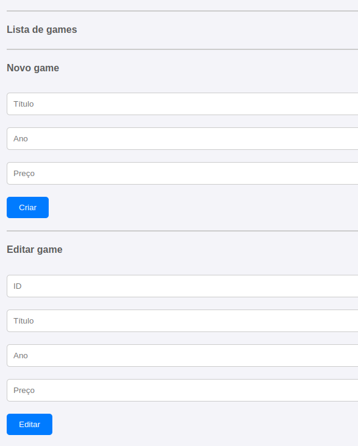
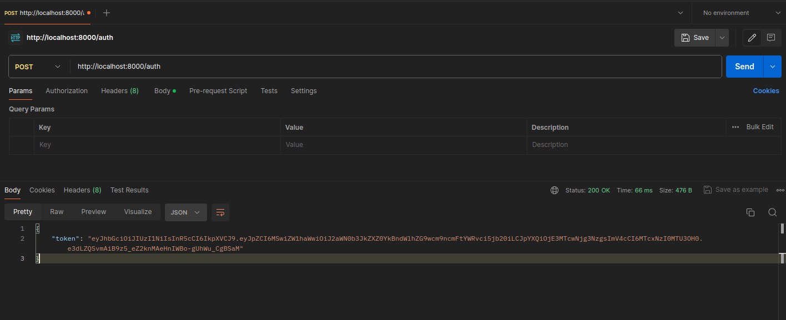

# API REST com autenticação JWT

API REST de um sistema de consulta e manipulação de jogos em um banco de dados fictício.

## Logo

### Interface do usuário

  

### Teste da API

  

## Sumário

- [Tecnologias Utilizadas](#tecnologias-utilizadas)
- [Status](#status)
- [Descrição](#descrição)
- [Funcionalidades](#funcionalidades)
- [Como Usar](#como-usar)
- [Estrutura do Projeto](#estrutura-do-projeto)
- [Autor](#autor)

## Tecnologias Utilizadas

  

    
  

  

    
  

## Status

<!--  -->

## Descrição

Esse projeto consiste em uma API de games responsável por realizar o login com autenticação do usuário, este que pode adicionar novos jogos a lista, pode excluir ou editar os jogos.

## Funcionalidades

- Autenticação de usuario.
- Login de usuario.
- Adição de jogos no banco de dados.
- Edição de jogos no banco de dados.
- Exclusão jogos no banco de dados.

## Como Usar

1. Clone o reṕositorio em sua maquina local
2. cd pastaDoArquivo
3. npm init
4. npm install express --save
5. node main.js

Com isso a API já esta rodando, para consumir esta API basta ir no index.html e utilizar a extensão liveServer para ter acesso a interface.

## Estrutura do Projeto

-Front-end

1. index.html
2. index.js
3. styles.css

-main.js

-img

## Autor

Desenvolvido por Diego Franco.
